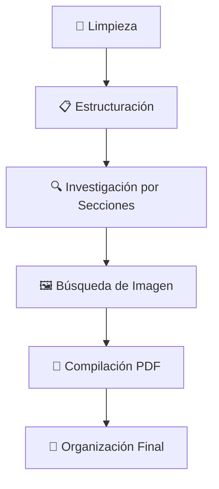

# 📄 CrewAI PDF Generator

Aplicación web construida con **Streamlit** que utiliza **CrewAI** y modelos de lenguaje locales (a través de **Ollama**) para generar documentos PDF detallados sobre cualquier tema proporcionado por el usuario.

**Desarrollado por:** William Atef Tadrous y Julián Cussianovich  
**Asignatura:** AIN - Grupo 3CO11  
**Optimizado para:** gemma3:1b y gemma3:4b

## 🚀 Inicio Rápido con Docker

### Prerrequisitos
- [Docker Desktop](https://www.docker.com/products/docker-desktop/) instalado
- [Ollama](https://ollama.com/) ejecutándose en tu máquina host

### 1. Configurar Ollama (en tu máquina, no en Docker)
```bash
# Instalar Ollama desde https://ollama.com/
# Ejecutar el servicio
ollama serve

# Descargar modelos recomendados
ollama pull gemma3:4b
ollama pull gemma3:1b
```

### 2. Configurar el proyecto
```bash
# Clonar el repositorio
git clone <tu-repositorio>
cd crewai_pdf_generator

# Crear archivo de configuración
cp .env.example .env
```

### 3. Configurar variables de entorno
Edita el archivo `.env` con tus credenciales:
```bash
# Obtener API key gratuita en https://serper.dev/
SERPER_API_KEY=tu_clave_serper_aqui
OLLAMA_HOST=localhost:11434
```

### 4. Ejecutar con Docker

#### Opción A: Script automático (recomendado)
```bash
# macOS/Linux
chmod +x run-docker.sh
./run-docker.sh

# Windows
run-docker.bat
```

#### Opción B: Comandos manuales
```bash
docker compose build
docker compose up
```

### 5. Acceder a la aplicación
🌐 **http://localhost:8501**

## 🏗️ Arquitectura

```
┌─────────────────┐    ┌─────────────────┐    ┌─────────────────┐
│   Streamlit     │    │   CrewAI        │    │   Ollama        │
│   (Docker)      │◄──►│   (Docker)      │◄──►│   (Host)        │
│   Puerto 8501   │    │   Agentes AI    │    │   Puerto 11434  │
└─────────────────┘    └─────────────────┘    └─────────────────┘
```

**Ventajas de esta configuración:**
- ✅ **Multiplataforma**: Funciona en Windows, macOS y Linux
- ✅ **Rendimiento**: Ollama ejecutándose nativamente para mejor uso de GPU
- ✅ **Consistencia**: Aplicación containerizada 
- ✅ **Persistencia**: Modelos y archivos se mantienen entre reinicios
3. Abre tu navegador en la URL que indique Streamlit (usualmente `http://localhost:8501`).

## ✨ Funcionalidades Principales

- **🌐 Interfaz Web Intuitiva**: Construida con Streamlit y completamente containerizada
- **🤖 Múltiples Agentes IA**: CrewAI orquesta agentes especializados para cada tarea
- **🎯 Selección de Modelos**: Compatible con múltiples modelos LLM a través de Ollama
- **📝 Generación Automatizada**: Investigación, estructuración y redacción completamente automática
- **📊 Visualización del Flujo**: Diagrama interactivo HTML del proceso CrewAI
- **📋 Exportación PDF**: Documentos profesionales con imágenes y formato avanzado
- **🔧 Optimizado para gemma3**: Configuración específica para mejores resultados

## 🛠️ Comandos Útiles

### Gestión de contenedores
```bash
# Ver logs en tiempo real
docker compose logs -f

# Parar servicios
docker compose down

# Rebuild completo
docker compose down && docker compose build --no-cache && docker compose up
```

### Diagnóstico
```bash
# Verificar Ollama desde Docker
docker run --rm curlimages/curl curl -f http://host.docker.internal:11434/api/tags

# Estado de contenedores
docker compose ps

# Acceder al contenedor
docker compose exec crewai-app bash
```

## 🚨 Solución de Problemas

### "No se encontraron modelos Ollama"
```bash
ollama serve
ollama list
ollama pull gemma3:4b
```

### "Connection refused to localhost:11434"
```bash
# Windows/Mac: verificar conectividad
ping host.docker.internal

# Linux: cambiar en .env
OLLAMA_HOST=172.17.0.1:11434
```

### Aplicación muy lenta
- Usar `gemma3:1b` en lugar de `gemma3:4b`
- Verificar memoria RAM disponible
- Cerrar aplicaciones que consuman recursos

## 📚 Documentación Detallada

Para instrucciones completas de instalación, configuración avanzada y solución de problemas, consulta:
📖 **[DOCKER_README.md](DOCKER_README.md)**

## 🏠 Ejecución Local (Alternativa)

Si prefieres ejecutar sin Docker:
```bash
pip install -r requirements.txt
streamlit run app.py
```
*Nota: Requiere Python 3.9+, Ollama local y configuración manual de dependencias del sistema.*

## 🏗️ Tecnologías Utilizadas

- **🐳 Docker**: Containerización para despliegue consistente
- **🐍 Python 3.11**: Lenguaje base de la aplicación
- **⚡ Streamlit**: Framework para la interfaz web interactiva
- **🤖 CrewAI**: Orquestación avanzada de agentes de IA
- **🦙 Ollama**: Ejecución local optimizada de LLMs
- **🔗 LangChain**: Integración de cadenas de LLM (usado por CrewAI)
- **📄 WeasyPrint**: Generación profesional de PDFs
- **🔍 Serper API**: Búsquedas web inteligentes

## 📁 Estructura del Proyecto

```
├── 🐳 Docker Configuration
│   ├── Dockerfile              # Imagen Docker de la aplicación
│   ├── docker-compose.yml      # Orquestación de servicios
│   ├── .dockerignore          # Archivos excluidos del build
│   ├── run-docker.sh          # Script de ejecución (Unix)
│   └── run-docker.bat         # Script de ejecución (Windows)
│
├── 🚀 Application Core
│   ├── app.py                 # Aplicación principal Streamlit
│   ├── requirements.txt       # Dependencias Python
│   └── .env.example          # Plantilla de configuración
│
├── 🤖 AI Agents (agents/)
│   ├── buscador.py           # Investigador y buscador de imágenes
│   ├── escritor.py           # Redactor técnico especializado
│   └── estructurador.py      # Arquitecto de documentos
│
├── 🔄 Workflows (flows/)
│   └── documento_flow.py     # Orquestación del flujo CrewAI
│
├── 🛠️ Tools (tools/)
│   ├── file_tools.py         # Manipulación de archivos
│   ├── pdf_tool.py           # Conversión Markdown → PDF
│   └── search_tools.py       # Búsquedas web e imágenes
│
├── ⚙️ Utilities (utils/)
│   ├── fix_encoding.py       # Corrección de codificación
│   ├── llm_provider.py       # Configuración de LLM
│   └── llm_selector.py       # Detección de modelos Ollama
│
└── 📂 Output Directories
    ├── output/               # PDFs generados (persistente)
    └── temp/                # Archivos temporales
```

## 🤖 Descripción de los Agentes IA

### 🏗️ Agente Estructurador (`estructurador.py`)
- **Rol:** Arquitecto de Documentos Técnicos
- **Función:** Crea estructura lógica y profesional en Markdown
- **Especialidad:** Organización jerárquica del contenido

### 🔍 Agente Buscador (`buscador.py`)
- **Investigador Digital:** Búsqueda de información técnica con `buscar_web`
- **Especialista en Imágenes:** Descarga imágenes relevantes con `buscar_y_descargar_imagen`
- **Especialidad:** Investigación web inteligente y curación de contenido visual

### ✍️ Agente Escritor (`escritor.py`)
- **Rol:** Redactor Técnico Especializado en Español
- **Función:** Redacción profesional y añadir contenido con `append_to_markdown`
- **Especialidad:** Escritura técnica de alta calidad en español

## 🔄 Flujo de Trabajo CrewAI

El sistema sigue un proceso estructurado de 5 fases:



1. **🧹 Limpieza y Preparación**: Limpia carpetas temporales y prepara el entorno
2. **📋 Estructuración**: Genera la arquitectura del documento en Markdown
3. **🔍 Procesamiento de Secciones**: Para cada sección → investigar + redactar
4. **🖼️ Imagen de Portada**: Descarga imagen relevante al tema
5. **📄 Compilación**: Convierte Markdown a PDF profesional con imágenes
6. **📁 Organización**: Mueve archivos y genera estadísticas del proceso

**Estado gestionado por `DocumentoState`**: tema, estructura, secciones, imagen, ruta PDF final.

## 🛠️ Herramientas Personalizadas

| Herramienta | Función | Ubicación |
|-------------|---------|-----------|
| `append_to_markdown()` | Añade contenido al Markdown temporal | `tools/file_tools.py` |
| `generar_pdf_desde_markdown()` | Convierte Markdown → PDF profesional | `tools/pdf_tool.py` |
| `buscar_web()` | Búsquedas inteligentes con Serper API | `tools/search_tools.py` |
| `buscar_y_descargar_imagen()` | Descarga imágenes relevantes | `tools/search_tools.py` |

## ⚙️ Utilidades del Sistema

| Utilidad | Propósito | Archivo |
|----------|-----------|---------|
| `fix_markdown_encoding()` | Corrige problemas de codificación | `utils/fix_encoding.py` |
| `crear_llm_crewai()` | Configura LLM optimizado para Docker/local | `utils/llm_provider.py` |
| `obtener_modelos_disponibles_ollama()` | Lista modelos instalados | `utils/llm_selector.py` |
| `seleccionar_llm()` | Auto-selecciona mejor modelo disponible | `utils/llm_selector.py` |

---

## 📞 Soporte y Contribución

- 📖 **Documentación completa**: [DOCKER_README.md](DOCKER_README.md)
- 🐛 **Reportar problemas**: Crear issue en el repositorio
- 💡 **Mejoras**: Pull requests bienvenidos
- 📧 **Contacto**: William Atef Tadrous y Julián Cussianovich

**¡Listo para generar PDFs con IA! 🚀**
