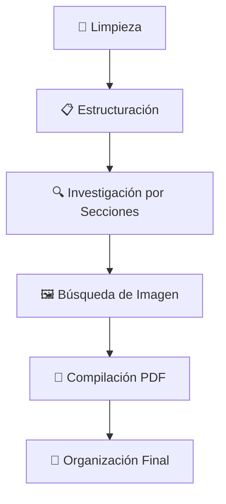

# 📄 CrewAI PDF Generator

Aplicación web construida con **Streamlit** que utiliza **CrewAI** y la **API de Gemini** para generar documentos PDF detallados sobre cualquier tema proporcionado por el usuario.

**Desarrollado por:** William Atef Tadrous y Julián Cussianovich  
**Asignatura:** AIN - Grupo 3CO11  
**Optimizado para:** API de Gemini (gemini-2.0-flash)

## 🚀 Inicio Rápido con Docker

### Prerrequisitos
- [Docker Desktop](https://www.docker.com/products/docker-desktop/) instalado
- API keys gratuitas de Google (Gemini y Serper)

### 1. Obtener API Keys gratuitas

#### Gemini API (Google AI)
```bash
# Visita: https://ai.google.dev/
# Crea una cuenta gratuita
# Genera tu API key de Gemini
```

#### Serper API (Búsquedas web)
```bash
# Visita: https://serper.dev/
# Crea una cuenta gratuita
# Obtén tu API key para búsquedas
```

### 2. Configurar el proyecto
```bash
# Clonar el repositorio
git clone *link a mi repo*
cd crewai_pdf_generator

# Crear archivo de configuración
cp .env.example .env
```

### 3. Configurar variables de entorno
Edita el archivo `.env` con tus credenciales:
```bash
# API Key para búsquedas web (gratuita en https://serper.dev/)
SERPER_API_KEY=tu_clave_serper_aqui

# API Key para Gemini (gratuita en https://ai.google.dev/)
GEMINI_API_KEY=tu_clave_gemini_aqui
```

### 4. Ejecutar con Docker

#### Opción A: Script automático (recomendado)
```bash
# macOS/Linux
chmod +x run-docker.sh
./run-docker.sh

# Windows
run-docker.bat
```

#### Opción B: Comandos manuales
```bash
docker compose build
docker compose up
```

### 5. Acceder a la aplicación
🌐 **http://localhost:8501**

## 🏗️ Arquitectura

```
┌─────────────────┐    ┌─────────────────┐    ┌─────────────────┐
│   Streamlit     │    │   CrewAI        │    │   Gemini API    │
│   (Docker)      │◄──►│   (Docker)      │◄──►│   (Cloud)       │
│   Puerto 8501   │    │   Agentes AI    │    │   Google AI     │
└─────────────────┘    └─────────────────┘    └─────────────────┘
```

**Ventajas de esta configuración:**
- ✅ **Multiplataforma**: Funciona en Windows, macOS y Linux sin dependencias locales
- ✅ **Rendimiento**: API de Gemini ofrece respuestas rápidas y consistentes
- ✅ **Simplicidad**: No requiere instalación de modelos locales
- ✅ **Escalabilidad**: Manejo automático de rate limiting y optimización de requests
- ✅ **Estabilidad**: Modelos en la nube vs. problemas de modelos locales pequeños

## ✨ Funcionalidades Principales

- **🌐 Interfaz Web Intuitiva**: Construida con Streamlit y completamente containerizada
- **🤖 Múltiples Agentes IA**: CrewAI Flows orquesta agentes especializados con control de flujo robusto
- **🎯 API Key Configurable**: Usa tu propia API key de Gemini o la del archivo .env
- **⚡ Rate Limiting Inteligente**: Control de max_rpm configurable (recomendado: 10 para API gratuita)
- **📝 Generación Automatizada**: Investigación, estructuración y redacción completamente automática
- **🔄 Flujo Secuencial Garantizado**: Control de estados y transiciones automáticas entre fases
- **📋 Exportación PDF**: Documentos profesionales con imágenes y formato avanzado
- **🔧 Optimizado para Gemini**: Configuración específica para mejores resultados con modelos en la nube

## 💡 ¿Por qué Gemini API en lugar de modelos locales?

Después de extensas pruebas, hemos migrado de modelos locales (Ollama) a la API de Gemini por las siguientes razones:

- **🎯 Estabilidad**: Los modelos locales pequeños (como gemma3:4b) son difíciles de hacer estables para tareas complejas
- **📊 Consistencia**: Gemini ofrece respuestas más consistentes y de mayor calidad
- **⚡ Velocidad**: Menor latencia que modelos locales en hardware limitado
- **🔧 Simplicidad**: No requiere configuración compleja de GPU/CPU ni descargas de modelos
- **💰 Costo**: La API gratuita de Gemini es suficiente para uso normal (10 requests/minuto)

## 🛠️ Comandos Útiles

### Gestión de contenedores
```bash
# Ver logs en tiempo real
docker compose logs -f

# Parar servicios
docker compose down

# Rebuild completo
docker compose down && docker compose build --no-cache && docker compose up
```

### Diagnóstico
```bash
# Estado de contenedores
docker compose ps

# Acceder al contenedor
docker compose exec crewai-app bash

# Verificar variables de entorno
docker compose exec crewai-app env | grep -E "(GEMINI|SERPER)"
```

## 🚨 Solución de Problemas

### "No se encontró GEMINI_API_KEY"
1. Verifica que tu archivo `.env` contiene la API key:
```bash
cat .env | grep GEMINI_API_KEY
```
2. O introduce la API key directamente en la interfaz web

### "Rate limit exceeded" o errores de API
- Reduce el valor de `max_rpm` en la interfaz (recomendado: 10 o menos)
- Verifica que tu API key de Gemini sea válida
- Espera unos minutos antes de reintentar

### "Error de búsqueda web"
- Verifica tu `SERPER_API_KEY` en el archivo `.env`
- Comprueba que tienes conexión a internet

### Aplicación muy lenta o errores de timeout
- Verificar conexión a internet estable
- Reducir el valor de `max_rpm` (recomendado: 5-10)
- Verificar memoria RAM disponible (recomendado mínimo 4GB)

## 📚 Documentación Detallada

Para instrucciones completas de instalación, configuración avanzada y solución de problemas, consulta:
📖 **[DOCKER_README.md](DOCKER_README.md)**

## 🏠 Ejecución Local (Alternativa)

Si prefieres ejecutar sin Docker:
```bash
pip install -r requirements.txt
streamlit run app.py
```
*Nota: Requiere Python 3.9+ y configuración manual de dependencias del sistema.*

## 🏗️ Tecnologías Utilizadas

- **🐳 Docker**: Containerización para despliegue consistente
- **🐍 Python 3.11**: Lenguaje base de la aplicación
- **⚡ Streamlit**: Framework para la interfaz web interactiva
- **🤖 CrewAI Flows**: Orquestación avanzada de agentes con control de flujo robusto
- **🔮 Gemini API**: Modelo de lenguaje avanzado de Google AI
- **🔗 LangChain**: Integración de cadenas de LLM (usado por CrewAI)
- **📄 WeasyPrint**: Generación profesional de PDFs
- **🔍 Serper API**: Búsquedas web inteligentes

## 📁 Estructura del Proyecto

```
├── 🐳 Docker Configuration
│   ├── Dockerfile              # Imagen Docker de la aplicación
│   ├── docker-compose.yml      # Orquestación de servicios
│   ├── .dockerignore          # Archivos excluidos del build
│   ├── run-docker.sh          # Script de ejecución (Unix)
│   └── run-docker.bat         # Script de ejecución (Windows)
│
├── 🚀 Application Core
│   ├── app.py                 # Aplicación principal Streamlit
│   ├── requirements.txt       # Dependencias Python
│   └── .env.example          # Plantilla de configuración
│
├── 🤖 AI Agents (agents/)
│   ├── buscador.py           # Investigador y buscador de imágenes
│   ├── escritor.py           # Redactor técnico especializado
│   └── estructurador.py      # Arquitecto de documentos
│
├── 🔄 Workflows (flows/)
│   └── documento_flow.py     # Orquestación del flujo CrewAI Flows
│
├── 🛠️ Tools (tools/)
│   ├── file_tools.py         # Manipulación de archivos
│   ├── pdf_tool.py           # Conversión Markdown → PDF
│   └── search_tools.py       # Búsquedas web e imágenes
│
├── ⚙️ Utilities (utils/)
│   ├── fix_encoding.py       # Corrección de codificación
│   └── llm_provider.py       # Configuración de Gemini API
│
└── 📂 Output Directories
    ├── output/               # PDFs generados (persistente)
    └── temp/                # Archivos temporales
```

## 🤖 Descripción de los Agentes IA

### 🏗️ Agente Estructurador (`estructurador.py`)
- **Rol:** Arquitecto de Documentos Técnicos
- **Función:** Crea estructura lógica y profesional en Markdown
- **Especialidad:** Organización jerárquica del contenido
- **LLM:** Utiliza Gemini API para generar estructuras coherentes

### 🔍 Agente Buscador (`buscador.py`)
- **Investigador Digital:** Búsqueda de información técnica con `buscar_web`
- **Especialista en Imágenes:** Descarga imágenes relevantes con `buscar_y_descargar_imagen`
- **Especialidad:** Investigación web inteligente y curación de contenido visual
- **LLM:** Utiliza Gemini API para análisis contextual de resultados de búsqueda

### ✍️ Agente Escritor (`escritor.py`)
- **Rol:** Redactor Técnico Especializado en Español
- **Función:** Redacción profesional y añadir contenido con `append_to_markdown`
- **Especialidad:** Escritura técnica de alta calidad en español
- **LLM:** Utiliza Gemini API para generar contenido coherente y bien estructurado

## 🔄 Flujo de Trabajo CrewAI Flows

El sistema utiliza la nueva arquitectura **CrewAI Flows** que proporciona un control de flujo más robusto y secuencial. El proceso se estructura en 5 fases bien definidas:



1. **🧹 Limpieza y Preparación**: Limpia carpetas temporales y prepara el entorno
2. **📋 Estructuración**: Genera la arquitectura del documento en Markdown usando agente estructurador
3. **🔍 Procesamiento de Secciones**: Para cada sección → crea agentes frescos → investigar + redactar
4. **🖼️ Imagen de Portada**: Descarga imagen relevante al tema usando herramientas de búsqueda
5. **📄 Compilación**: Convierte Markdown a PDF profesional con imágenes
6. **📁 Organización**: Mueve archivos a `output/` y genera estadísticas del proceso

**Estado gestionado por `DocumentoState`**: tema, modelo, estructura, secciones, imagen, ruta PDF final.

### 📋 DocumentoState - Gestión de Estado Centralizada

El estado del flujo se gestiona a través de una clase `DocumentoState` que hereda de Pydantic BaseModel:

```python
class DocumentoState(BaseModel):
    topic: str = ""                    # Tema del documento
    gemini_api_key: str = ""          # API key de Gemini (opcional)
    max_rpm: int = 10                 # Rate limiting configurable
    estructura_completa: str = ""      # Estructura generada en Markdown
    secciones_lista: list[str] = []    # Lista de secciones extraídas
    total_secciones: int = 0           # Contador de secciones
    archivo_markdown: str = "temp/temp_markdown.md"  # Archivo temporal
    imagen_portada: str = ""           # Ruta de imagen descargada
    pdf_final: str = ""                # Ruta del PDF generado
```

Esta gestión centralizada del estado permite:
- ✅ **Persistencia entre pasos**: Los datos se mantienen durante todo el flujo
- ✅ **Validación automática**: Pydantic valida tipos y formatos
- ✅ **Rate Limiting Inteligente**: Control configurable de requests por minuto
- ✅ **API Key Flexible**: Usa API key personalizada o del archivo .env
- ✅ **Trazabilidad**: Cada paso puede acceder y modificar el estado
- ✅ **Debugging mejorado**: Fácil inspección del estado en cualquier momento

### Ventajas de CrewAI Flows con Gemini API
- ✅ **Control de flujo robusto**: Manejo de estados y transiciones automáticas
- ✅ **Rate limiting inteligente**: Evita superar límites de la API gratuita
- ✅ **Ejecución secuencial garantizada**: Cada paso se completa antes del siguiente
- ✅ **Gestión de errores mejorada**: Mejor manejo de excepciones entre pasos
- ✅ **Escalabilidad**: Fácil adición de nuevos pasos al flujo
- ✅ **Monitoreo**: Logs detallados de cada fase del proceso

## 🛠️ Herramientas Personalizadas

| Herramienta | Función | Ubicación |
|-------------|---------|-----------|
| `append_to_markdown()` | Añade contenido al Markdown temporal | `tools/file_tools.py` |
| `generar_pdf_desde_markdown()` | Convierte Markdown → PDF profesional | `tools/pdf_tool.py` |
| `buscar_web()` | Búsquedas inteligentes con Serper API | `tools/search_tools.py` |
| `buscar_y_descargar_imagen()` | Descarga imágenes relevantes | `tools/search_tools.py` |
| `_buscar_imagen_base()` | Función base para búsqueda de imágenes | `tools/search_tools.py` |
| `_generar_pdf_base()` | Función base para generación de PDF | `tools/pdf_tool.py` |

## ⚙️ Utilidades del Sistema

| Utilidad | Propósito | Archivo |
|----------|-----------|---------|
| `fix_markdown_encoding()` | Corrige problemas de codificación | `utils/fix_encoding.py` |
| `crear_llm_crewai()` | Configura Gemini API con rate limiting | `utils/llm_provider.py` |

### Nuevas Características de la Arquitectura

- **🔄 CrewAI Flows**: Utiliza la nueva arquitectura de flows para un control de flujo más robusto
- **📊 Estado Centralizado**: `DocumentoState` gestiona todo el estado del flujo con BaseModel de Pydantic
- **🔗 Decoradores de Flow**: `@start()` y `@listen()` para definir transiciones entre pasos
- **🎯 API Key Configurable**: Flexibilidad para usar API keys personalizadas o del .env
- **⚡ Rate Limiting**: Control inteligente para evitar superar límites de API gratuita
- **📈 Logging Mejorado**: Seguimiento detallado de cada fase del proceso

---

**¡Listo para generar PDFs con IA usando CrewAI Flows y Gemini API! 🚀**
